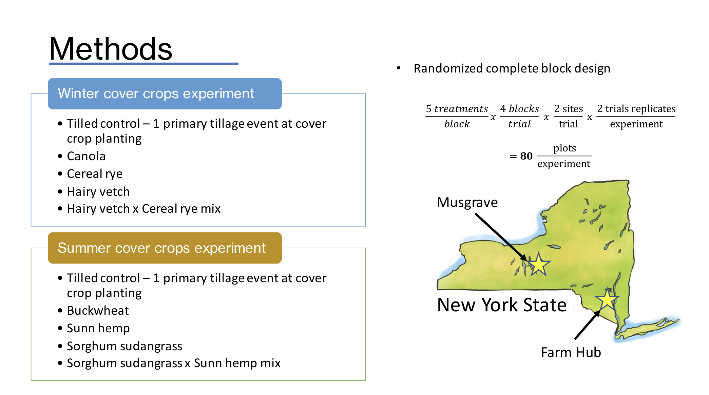

# phylogenetic-competition

Does the phylogenetic relatedness of cover crops impact their competition with weeds?

These files contain the data and code that [Menalled et al. (2023)](https://doi.org/10.1038/s41598-023-43987-x) used to test how the relatedness between cover crops and weeds affects weed suppression and community assembly. The data was generated through winter and summer field experiments replicated for four site-years. Each site-year consisted of four cover crop treatments and one tilled control, replicated in four blocks for a total of 20 plots per site-year. Plant biomass was sampled at the end of the cover crop growing season in two 0.25 m2 (76 cm × 33 cm) quadrats randomly placed in each plot. During sampling, each quadrat was placed perpendicularly over four crop rows to ensure a consistent proportion of crop row and interrow area. To avoid pseudoreplication, samples were summed at the plot level. The samples were dried at 60 °C for at least 2 weeks before obtaining dry weight for analysis. Results show that cover crops can modify weed community structure by suppressing phylogenetically related weed species more intensely than phylogenetically unrelated weeds. All analyses and results are reported and discussed in Menalled et al. (2023): “[Phylogenetic relatedness can influence cover crop-based weed suppression](https://doi.org/10.1038/s41598-023-43987-x).”

{width="531"}

Analysis and data for the publication, *"Phylogenetic relatedness can influence cover crop-based weed suppression"*
